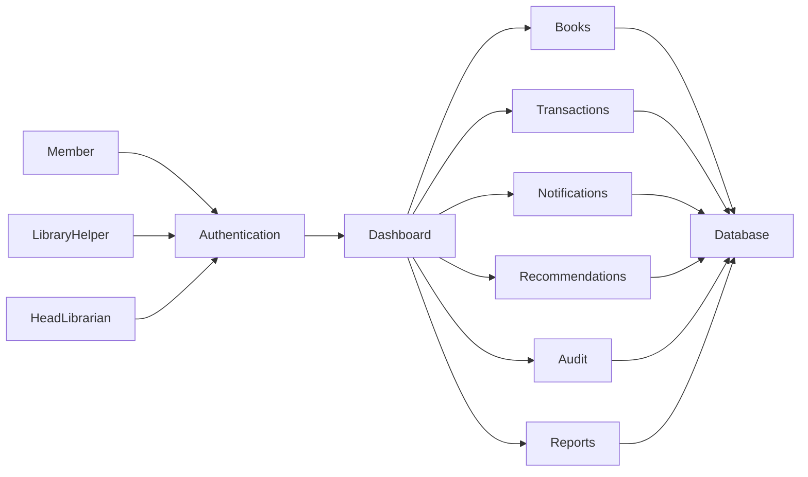
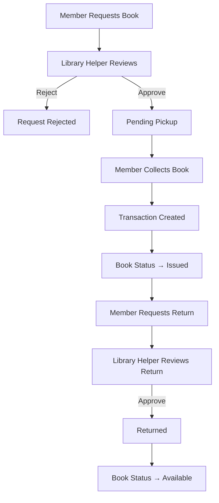

# 📚 MVTC Library Management System

> A modern, role-based Library Management System built with Django to streamline library operations, book circulation, member management, notifications, reporting, and analytics.


---

## 📖 Overview

The **MVTC Library Management System** is a production-style web application developed using **Django** to digitize and automate the complete workflow of a library.

Unlike a traditional CRUD-based library application, this project focuses on real-world circulation workflows including **book requests, pending pickups, issue management, return approvals, notifications, audit logging, analytics, and role-based access control**.

The system provides dedicated dashboards and permissions for **Head Librarians**, **Library Helpers**, and **Members**, ensuring secure and efficient management of library resources.

---

# ✨ Highlights

- 🔐 Role-Based Authentication
- 👥 Three-Level Permission System
- 📚 Complete Book Circulation Workflow
- 📦 Pending Pickup Management
- 🔔 Notification Center
- ⚡ AJAX Live Book Search
- 🌗 Dark / Light Theme
- 📥 Excel Book Import
- 📈 Dashboard Analytics
- 📊 Reports
- 📝 Audit Logging
- 📖 Book Recommendation System
- 📱 Responsive Interface
- 🚀 Deployed on PythonAnywhere

---

# 📑 Table of Contents

- [Overview](#-overview)
- [Features](#-features)
- [System Architecture](#-system-architecture)
- [User Roles](#-user-roles)
- [Book Circulation Workflow](#-book-circulation-workflow)
- [Technology Stack](#-technology-stack)
- [Project Structure](#-project-structure)
- [Installation](#-installation)
- [Environment Variables](#-environment-variables)
- [Deployment](#-deployment)
- [Screenshots](#-screenshots)
- [Future Enhancements](#-future-enhancements)
- [Author](#-author)

---

# 🚀 Features

## 👤 Authentication

- Secure Login
- User Registration
- Password Reset
- Password Change
- Profile Editing
- Employee Information
- Department & Designation Support

---

## 🔐 Role Based Access

### 👑 Head Librarian

- Full administrative access
- Manage Books
- Manage Members
- Import Books
- View Reports
- View Dashboard Analytics
- Manage Recommendations
- View Audit Logs
- Manage Notifications

### 📚 Library Helper

- Approve Book Requests
- Reject Book Requests
- Confirm Book Collection
- Approve Returns
- Manage Transactions
- Assist Members
- Manage Book Circulation

### 👨‍🎓 Member

- Browse Catalog
- Search Books
- Request Books
- View Issued Books
- Request Returns
- Recommend Books
- Receive Notifications

---
# 📚 Book Management

The system maintains a comprehensive digital catalog of library resources.

### Features

- Add New Books
- Edit Existing Books
- Delete Books
- View Book Details
- Browse Complete Catalog
- Search Books
- Filter by Category
- Track Availability
- Rack / Shelf Location Management
- Acquisition Tracking
- Donor Management

---

## 📖 Book Information

Each book stores detailed metadata including:

- Accession Number
- Serial Number
- Title
- Author
- Publisher
- Category
- Publication Year
- Number of Pages
- Price
- Volume Quantity
- Acquisition Type
- Donor Information
- Rack Location
- Remarks
- Current Status

---

## 📌 Book Status

Books move through the following lifecycle:

| Status | Description |
|---------|-------------|
| 📗 Available | Ready to be requested |
| 📦 Pending Pickup | Approved but awaiting collection |
| 📖 Issued | Collected by the member |
| 🔧 Maintenance | Temporarily unavailable |
| 📚 Archived | Removed from active circulation |

---

# ⚡ AJAX Live Search

The catalog supports dynamic searching using AJAX.

### Features

- Instant search results
- No page refresh required
- Search by:
  - Title
  - Author
  - Publisher
  - Category
  - Accession Number
- Fast user experience

---

# 🌗 Theme Support

The application includes built-in theme switching.

### Available Themes

- 🌞 Light Mode
- 🌙 Dark Mode

Theme preference is remembered for a consistent user experience.

---

# 🔔 Notification System

A centralized notification system keeps both staff and members informed about important events.

### Notifications for Members

- Book Request Approved
- Ready for Pickup
- Book Successfully Issued
- Return Approved
- General Library Updates

### Notifications for Library Staff

- New Book Request
- Return Request Submitted
- Recommendation Submitted

Each notification contains:

- Title
- Description
- Timestamp
- Direct navigation link

---

# 📊 Dashboard

Each user role has a dedicated dashboard.

---

## 👑 Head Librarian Dashboard

Displays:

- 📚 Total Books
- ✅ Available Books
- 📖 Issued Books
- ⚠ Overdue Books
- 👥 Total Members
- 📈 Monthly Statistics
- 📚 Recently Added Books
- 🔄 Recent Transactions
- 🏆 Top Borrowed Books
- 📝 Recent Audit Activity

---

## 📚 Library Helper Dashboard

Provides quick operational access.

Includes:

- Member Count
- Recently Added Books
- Recent Transactions
- Pending Requests
- Quick Navigation Buttons

---

## 👨‍🎓 Member Dashboard

Members can view:

- Books Currently Issued
- Pending Pickup Requests
- Pending Book Requests
- Approved Requests
- Rejected Requests
- Recent Request History

---

# 📥 Excel Import System

Books can be imported in bulk using Microsoft Excel.

Supported fields include:

- Accession Number
- Serial Number
- Title
- Author
- Publisher
- Category
- Publication Year
- Volume Quantity
- Donor
- Acquisition Type

This significantly reduces manual data entry for large collections.

---

# 📖 Book Recommendation System

Members can recommend books that are unavailable in the library.

### Recommendation Workflow

Member Recommendation

↓

Head Librarian Review

↓

Approved / Rejected

↓

Recommendation History

---

# 📊 Reports

The system generates useful statistics for administrators.

Reports include:

- Books Issued This Month
- Books Returned This Month
- Newly Added Books
- Overdue Books
- Most Borrowed Books
- Inventory Overview

---

# 📝 Audit Logging

Every important administrative action is recorded.

Examples include:

- Book Created
- Book Updated
- Book Deleted
- Book Imported
- Book Issued
- Collection Confirmed
- Return Approved
- Member Management

Audit logs include:

- User
- Action
- Timestamp
- Description

This ensures complete traceability of system activity.
# 🏗 System Architecture



---

# 🔄 Book Circulation Workflow



---

# 📂 Project Structure

```text
LibraryManagementSystem/

├── accounts/
├── administration/
├── audit/
├── book_requests/
├── books/
├── dashboard/
├── donors/
├── imports/
├── notifications/
├── recommendations/
├── reports/
├── transactions/
│
├── static/
├── templates/
├── media/
│
├── config/
├── manage.py
├── requirements.txt
└── README.md
```

---

# 🛠 Technology Stack

| Layer | Technology |
|--------|------------|
| Backend | Python |
| Framework | Django |
| Frontend | HTML5 |
| Styling | Bootstrap 5 |
| JavaScript | Vanilla JavaScript + AJAX |
| Database | SQLite |
| Date Picker | Flatpickr |
| Authentication | Django Authentication |
| Deployment | PythonAnywhere |
| Version Control | Git & GitHub |

---

# ⚙ Installation

## Clone Repository

```bash
git clone https://github.com/Kaustubh-Kushaagra/LibraryManagementSystem.git

cd LibraryManagementSystem
```

---

## Create Virtual Environment

Windows

```bash
python -m venv venv

venv\Scripts\activate
```

Linux

```bash
python3 -m venv venv

source venv/bin/activate
```

---

## Install Requirements

```bash
pip install -r requirements.txt
```

---

## Environment Variables

Create a `.env` file in the project root.

Example:

```env
SECRET_KEY=your-secret-key

DEBUG=True

EMAIL_HOST=

EMAIL_PORT=

EMAIL_HOST_USER=

EMAIL_HOST_PASSWORD=

DEFAULT_FROM_EMAIL=
```

---

## Apply Migrations

```bash
python manage.py migrate
```

---

## Create Superuser

```bash
python manage.py createsuperuser
```

---

## Collect Static Files

```bash
python manage.py collectstatic
```

---

## Run Development Server

```bash
python manage.py runserver
```

---

# 🌐 Deployment

The project is deployed using **PythonAnywhere**.

Deployment includes:

- Virtual Environment
- Static Files
- Database
- Environment Variables
- WSGI Configuration

---

# 📸 Screenshots

> Replace these placeholders with actual screenshots.

## Login Page

```
screenshots/login.png
```

---

## Head Librarian Dashboard

```
screenshots/dashboard_admin.png
```

---

## Library Helper Dashboard

```
screenshots/dashboard_helper.png
```

---

## Member Dashboard

```
screenshots/dashboard_member.png
```

---

## Book Catalog

```
screenshots/catalog.png
```

---

## Book Detail

```
screenshots/book_detail.png
```

---

## Pending Requests

```
screenshots/pending_requests.png
```

---

## Notifications

```
screenshots/notifications.png
```

---

## Reports

```
screenshots/reports.png
```

---

# 🎯 Key Modules

✅ Authentication

✅ Book Management

✅ Transactions

✅ Book Requests

✅ Notifications

✅ Dashboard

✅ Recommendations

✅ Reports

✅ Audit Logging

✅ Excel Import

---

# 🔮 Future Enhancements

- Barcode Scanner Support
- QR Code Integration
- Email Due Date Reminders
- SMS Notifications
- PDF Report Generation
- REST API
- Mobile Application
- Multi-Branch Library Support
- Fine Calculation Module
- Book Reservation Queue

---

# 🤝 Contributing

Contributions, feature requests and suggestions are welcome.

To contribute:

1. Fork the repository
2. Create a feature branch
3. Commit your changes
4. Push your branch
5. Open a Pull Request

---

# 👨‍💻 Author

**Kaustubh Kushaagra**

GitHub

https://github.com/Kaustubh-Kushaagra

---

# 📄 License

This project was developed for educational and organizational use.

Feel free to modify and extend it according to your requirements.

---

# ⭐ Support

If you found this project useful, consider giving the repository a ⭐ on GitHub.

It helps others discover the project and motivates further development.

---

<div align="center">

### 📚 Happy Reading!

Made with ❤️ using Django

</div>